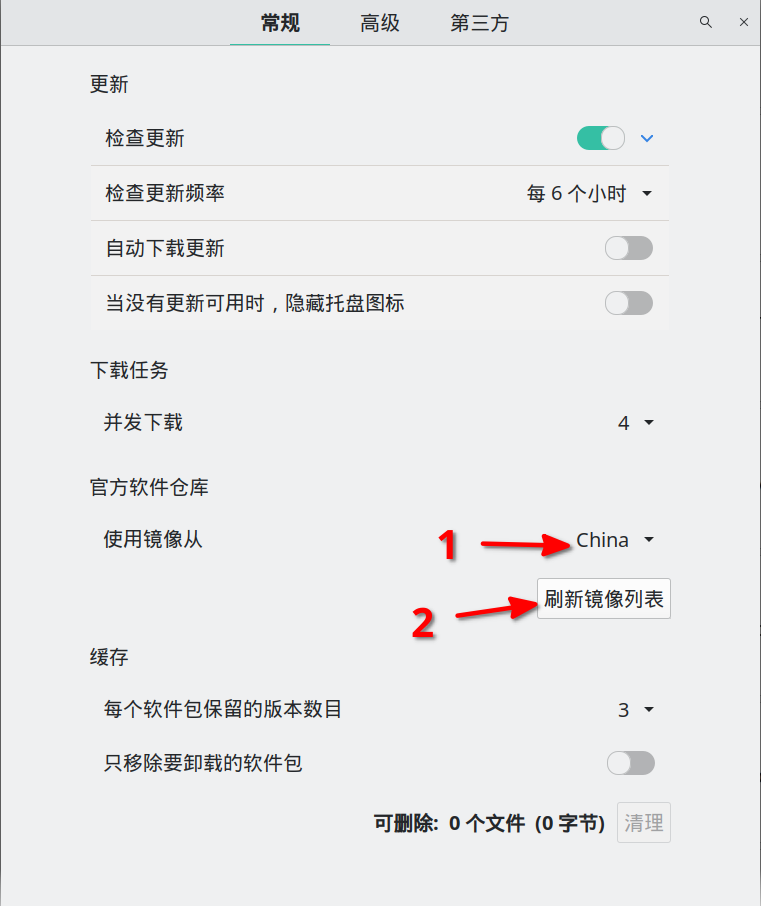
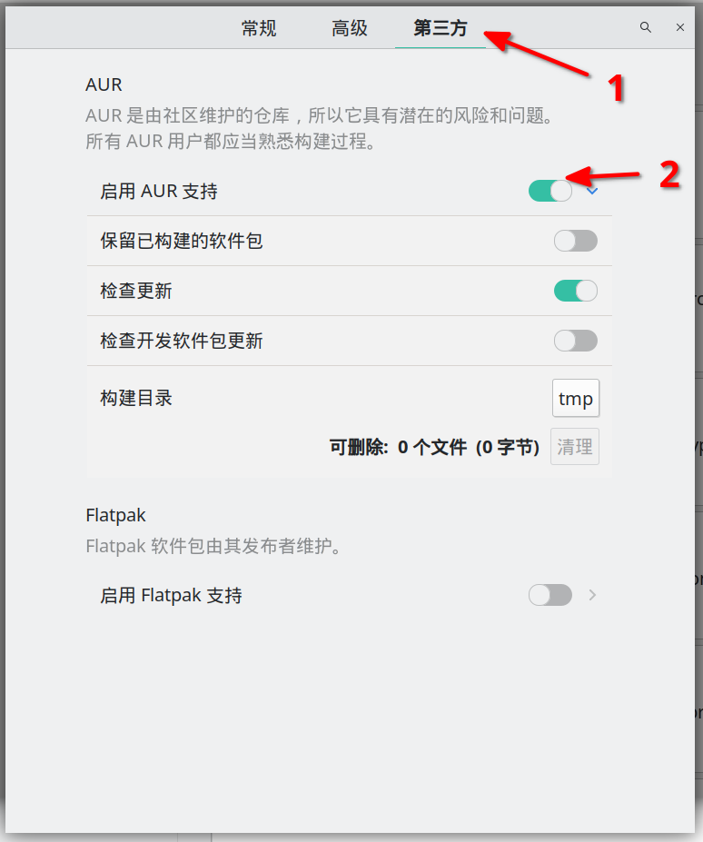

# Ubuntu-config

#### 介绍
Ubuntu 20.04 LTS 配置脚本

## 安装zsh
```
sudo apt install zsh
```
## 修改默认路由（网关）
如果使用网关代理使用下方命令，IP地址根据实际修改。
```
修改默认网关
ip route add default via 192.168.0.121
删除默认网关
ip route del default
```
## 安装ohmyzsh

```
sh -c "$(curl -fsSL https://raw.github.com/ohmyzsh/ohmyzsh/master/tools/install.sh)"
```

## zsh-autosuggestion 自动补全
安装完zsh后
```
git clone https://github.com/zsh-users/zsh-autosuggestions ${ZSH_CUSTOM:-~/.oh-my-zsh/custom}/plugins/zsh-autosuggestions
```

打开`.zshrc`添加`zsh-autosuggestions`
```
plugins=(git zsh-autosuggestions)
```
## Ubuntu 使用代理服务器使用方法
### 修改`proxy-ubuntu.sh`中的地址和端口，然后保存
```
hostip=192.168.0.150
port=7890
```
### 设置代理
```
source ./proxy-ubuntu.sh set
```
### 取消代理
```
source ./proxy-ubuntu.sh unset
```
### 查看代理
```
source ./proxy-ubuntu.sh test
```
## WSL2 代理配置
修改`proxy-wsl2.sh`中的端口，然后保存，使用方法和上面介绍相同。

第一次使用需要设置Windows主机的防火墙：

### 查看Ubuntu的IP
在WSL2中查看Ubuntu的ip地址，使用命令`ip addr show`结果如下：

```
1: lo: <LOOPBACK,UP,LOWER_UP> mtu 65536 qdisc noqueue state UNKNOWN group default qlen 1000
    link/loopback 00:00:00:00:00:00 brd 00:00:00:00:00:00
    inet 127.0.0.1/8 scope host lo
       valid_lft forever preferred_lft forever
    inet6 ::1/128 scope host
       valid_lft forever preferred_lft forever
2: bond0: <BROADCAST,MULTICAST,MASTER> mtu 1500 qdisc noop state DOWN group default qlen 1000
    link/ether 76:25:32:6d:32:78 brd ff:ff:ff:ff:ff:ff
3: dummy0: <BROADCAST,NOARP> mtu 1500 qdisc noop state DOWN group default qlen 1000
    link/ether 1e:db:4c:d2:39:0a brd ff:ff:ff:ff:ff:ff
4: tunl0@NONE: <NOARP> mtu 1480 qdisc noop state DOWN group default qlen 1000
    link/ipip 0.0.0.0 brd 0.0.0.0
5: sit0@NONE: <NOARP> mtu 1480 qdisc noop state DOWN group default qlen 1000
    link/sit 0.0.0.0 brd 0.0.0.0
6: eth0: <BROADCAST,MULTICAST,UP,LOWER_UP> mtu 1500 qdisc mq state UP group default qlen 1000
    link/ether 00:15:5d:b2:b8:a5 brd ff:ff:ff:ff:ff:ff
    inet 172.28.252.63/20 brd 172.28.255.255 scope global eth0
       valid_lft forever preferred_lft forever
    inet6 fe80::215:5dff:feb2:b8a5/64 scope link
       valid_lft forever preferred_lft forever
```

其中第6组数据中的`172.28.252.63`就是WSL2中Ubuntu的IP地址。

### 新建防火墙入站规则

Windows系统下，`控制面板->系统安全->Windows Defender 防火墙->高级设置->入站规则->新建规则`

- 规则类型：自定义
- 程序：所有程序
- 协议和端口：任何
- 作用域：
    - 本地ip处选择“任何IP地址”
    - 远程ip处选择“下列IP地址”，并将wsl2的IP添加进去。（请根据自己WSL2的ip进行计算，我这里添加了172.28.252.63/20）（掩码一般是20位）
- 操作：允许连接
- 配置文件：三个全选
- 名称描述：请自定义

### 在Ubuntu中查看Windows主机的IP地址

运行命令

```
cat /etc/resolv.conf | grep nameserver | awk '{ print $2 }'
```

结果如下：

```
172.28.240.1
```

运行命令：

```
ping 172.28.240.1
```

结果如下：

```
lituo@DESKTOP-SG8Q3FM:~$ ping 172.28.240.1
PING 172.28.240.1 (172.28.240.1) 56(84) bytes of data.
64 bytes from 172.28.240.1: icmp_seq=1 ttl=128 time=0.241 ms
64 bytes from 172.28.240.1: icmp_seq=2 ttl=128 time=0.328 ms
64 bytes from 172.28.240.1: icmp_seq=3 ttl=128 time=0.340 ms
```
注意：完成上一步防火墙入站规则后，从WSL2 ping主机的ip应该可以ping通了。


## Manjaro 使用记录

### 常用命令

pacman 用法

```
sudo pacman -Syu 更新系统
```

yay用法

下载软件：`yay -S 软件名`

卸载软件：`yay -R 软件名`

搜索软件：`yay -Ss 软件模糊名`

### 安装中文输入法

```
sudo pacman -S fcitx fcitx-libpinyin kcm-fcitx
```

配置fcitx，打开`kate /etc/profile`最后添加

```
export GTK_IM_MODULE=fcitx
export QT_IM_MODULE=fcitx
export XMODIFIERS="@im=fcitx"
```

然后注销或者重启后，应该在右下角可以看到键盘打图标。

在键盘图标上右键选择`配置`就可以选择输入法了，切换输入法按`ctrl+空格`

### 启用AUR源

找到`删除/添加软件`这个程序。






### 安装常用软件

```
sudo pacman -S yay vim
```

### 安装wps

```
yay -S wps-office-cn wps-office-mui-zh-cn ttf-wps-fonts
```

### 开机自动启用数字键

```
sudo vim /etc/sddm.conf
```

将其中的`Numlock=none`改为`Numlock=no`即可。

### 再生龙恢复后无法启动

1. 使用命令`ls`查看分区，会出现如下字样：

`(hd0) (hd0,msdos9) (hd0,msdos8) (hd0,msdos7) (hd0,msdos6) (hd0,msdos5) (hd0,msdos2) (hd0,msdos1)`

注：上面是我的分区设备，每个人可能不一样，但原理都是一样的。

2. 寻找ubuntu所在分区：（就是寻找你的Linux系统是装在以上哪个分区里）

`grub rescue> ls (hd0,msdos1)/`

若出现的是你的ubuntu主文件夹下的文件夹和文件的名字，那就是的要找的分区了。

3. 修改启动分区：

（假如你找到的启动分区是hd0,msdos8）

```
grub rescue > set root=(hd0,msdos8)
grub rescue > set prefix=(hd0,msdos8)/boot/grub
grub rescue > insmod normal                            //启动normal启动
grub rescue > normal
```
之后你就会看到熟悉的启动菜单栏了

4. 进入系统后运行以下命令

```
sudo update-grub
sudo grub-install
```

如果出现这个错误`/usr/bin/grub-probe：警告： 未知的设备类型 nvme1n1.`，可以将`/etc/grub.d/60_memtest86+`文件删除

```
sudo rm -rf /etc/grub.d/60_memtest86+
```

## ArchLinux安装记录

### 设置大字体

```
setfont /usr/share/kbd/consolefonts/sun12x22.psfu.gz
```

### 无线网络连接

```
iwctl                                   #执行iwctl命令，进入交互式命令行
device list                             #列出设备名，比如无线网卡看到叫 wlan0
station wlan0 scan                      #用wlan0网卡扫描网络
station wlan0 get-networks              #列出网络
station wlan0 connect 无线网名字        #连接网络名字 输入密码
exit或者quit                            #成功后退出
```

如果使用上面命令无法连接就需要使用命令`rfkill unblock wifi`，然后再重复上面操作。

### 禁止自动更新服务器列表

```
systemctl stop reflector.service
```

### 设置时间

必须先设置时区然后再使能ntp。

```
timedatectl set-timezone Asia/Shanghai
timedatectl set-ntp 1
date
```

### 更新密钥环

```
pacman -Syy
pacman -S archlinux-keyring
```

### 创建分区

使用命令`cfdisk /dev/sdx`

### 格式化分区

```
mkswap /dev/sdxn
mkfs.btrfs -L myArch /dev/sdxn
```

### 挂载

#### 文件系统为btrfs

```bash
mount -t btrfs -o subvol=/@,compress=zstd /dev/sdxn /mnt # 挂载 / 目录
mkdir /mnt/home               # 创建 /home 目录
mount -t btrfs -o subvol=/@home,compress=zstd /dev/sdxn /mnt/home # 挂载 /home 目录
mkdir -p /mnt/boot            # 创建 /boot 目录
mount /dev/sdxn /mnt/boot     # 挂载 /boot 目录
swapon /dev/sdxn              # 挂载交换分区
```

#### 文件系统是ext4

```bash
mount /dev/sda2 /mnt
mkdir /mnt/home
mkdir /mnt/boot
mount /dev/sda1 /mnt/boot
mount /dev/sda3 /mnt/home
```

### 安装

必须安装的

```
pacstrap /mnt base base-devel linux linux-firmware
```

常用的

```
pacstrap /mnt dhcpcd iwd vim zsh zsh-completions openssh man git wget ntfs-3g grub efibootmgr os-prober btrfs-progs 
```

### 生成 fstab 文件

```
genfstab -U /mnt > /mnt/etc/fstab
```

**然后必须进行如下修改：**

**删除 `/` 和 `/home` 条目中最后的 `subvolid=xxx` 参数。**

**否则在使用 timeshift 进行恢复时会无法进入系统。**

### change root

```
arch-chroot /mnt
```

### 安装一些常用工具

```
pacman -Syy
pacman -S archlinux-keyring
```

### 安装引导程序

```
pacman -S grub efibootmgr os-prober
```

安装 GRUB 到 EFI 分区：

```
grub-install --efi-directory=/boot --bootloader-id=ArchLinux
```

修改`/etc/default/grub`文件

```
vim /etc/default/grub
```

打开`GRUB_DISABLE_OS_PROBER=false`这项

最后生成 GRUB 所需的配置文件：

```
grub-mkconfig -o /boot/grub/grub.cfg
```

### 使用 timeshift 进行备份

重启进入系统后，安装必要软件：

```
pacman -Sy timeshift btrfs-progs
```

切换为 btrfs 模式，同时会自动生成配置文件
```
timeshift --btrfs
```

打开配置文件`/etc/timeshift/timeshift.json`，下面是其中主要项目说明

```
{
  "backup_device_uuid" : "a99599f4-3acd-4c8d-8f7e-82a5df35b22e",    // 一般会自动生成
  "parent_device_uuid" : "",
  "do_first_run" : "false",
  "btrfs_mode" : "true",    // 确认是 true
  "include_btrfs_home_for_backup" : "true",  // 备份是否包括home目录
  "include_btrfs_home_for_restore" : "true", // 恢复是否包换home目录
  "stop_cron_emails" : "true",
  "schedule_monthly" : "false",
  "schedule_weekly" : "false",
  "schedule_daily" : "false",
  "schedule_hourly" : "false",
  "schedule_boot" : "false",
  "count_monthly" : "2",
  "count_weekly" : "3",
  "count_daily" : "5",
  "count_hourly" : "6",
  "count_boot" : "5",
  "snapshot_size" : "0",
  "snapshot_count" : "0",
  "date_format" : "%Y-%m-%d %H:%M:%S",
  "exclude" : [],
  "exclude-apps" : []
}
```

备份

```
timeshift --create --comments "shuo ming"
```

恢复

```
timeshift --restore
```

### btrfs 常用命令

挂载 btrfs 分区

```
sudo mount /dev/nvme1n1p4 /mnt
```

查看 btrfs 子卷

```
sudo btrfs subvolume list -u /
```

删除 btrfs 子卷

```
sudo btrfs subvolume delete /上一步看到的子卷
```

### 安装 gnome 桌面

```
pacman -Syy
pacman -Sy wqy-zenhei gnome gnome-extra 
```


### 添加archlinuxcn源

在文件/etc/pacman.conf文件中添加
```
[archlinuxcn]
Server = https://mirrors.bfsu.edu.cn/archlinuxcn/$arch
```

然后运行`sudo pacman -Sy archlinuxcn-keyring`

### 常用软件

```
yay visual-studio-code-bin microsoft-edge-stable-bin
```

### 蓝牙问题

```
sudo pacman -S bluez bluez-utils
```

### 安装输入法

首先必须先按照 [输入法教程](https://arch.icekylin.online/advanced/optional-cfg-1.html#%F0%9F%8D%80%EF%B8%8F-%E8%BE%93%E5%85%A5%E6%B3%95) 安装好 [🍀️四叶草拼音输入方案](https://github.com/fkxxyz/rime-cloverpinyin)。

然后从这个 [rime-cloverpinyin](https://github.com/so1ar/rime-cloverpinyin) 项目中下载 `clover-flypy.schema.yaml` 文件，放到目录 `~/.local/share/fcitx5/rime` 下面，

或者直接使用下面命令下载到指定目录：

```
wget -P ~/.local/share/fcitx5/rime https://raw.githubusercontent.com/so1ar/rime-cloverpinyin/main/src/clover-flypy.schema.yaml
```

然后修改 `default.custom.yaml` 文件中的 `clover` 为 `clover-flypy` 后重新部署即可。

